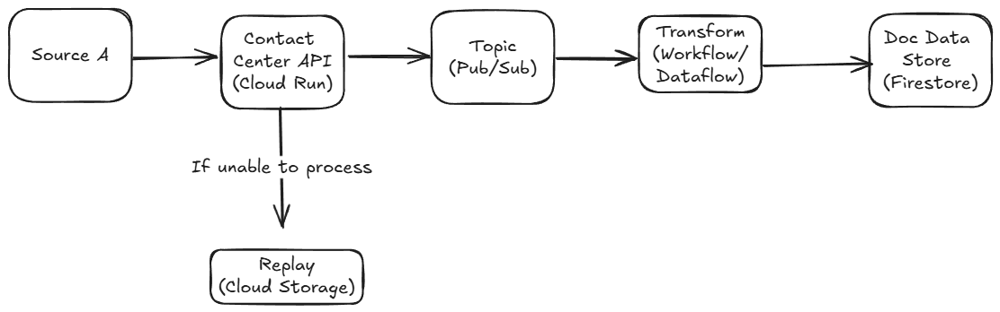

# Sales Transaction Streaming Pipeline Example

## Table of Contents

1. [Introduction](#introduction)
2. [Installation](#insallation)
3. [Usage](#usage)
4. [Data Sources](#data-sources)
5. [Contributions](#contributions)
6. [License](#license)
7. [Future Enhancements](#future-enhancements)
8. [Contact](#contact)

## Introduction

Many organisations want to have low latency data processes in relation to the customer and sales so that decisions can be made in a timely manner. Processing sales and customer data in a streaming fashion provides an opportunity and a challenge due to the stateful processing and latency requirements. This repository demonstrates an example of synthetic sales and customer data being published into Kafka and then processed using the Apache Beam data processing framework into a document data store.

Finally, the data should be easily accessible and consumed by end users. To ensure standardised integrations with downstream applications, an application programming interface (API) is built to enable fast retrieval of processed data.

## Installation

Below are the pre-requisites that can be used to generate the expected output of this repository.

|Software   | Version   |
|-----------|-----------|
|Java       |`22.0.2`   |
|Docker     |`>=27.2.0` |

## Usage

1. Start the zookeeper and kafka topic by executing the command `docker-compose up -d`

## Data Sources

All sources used in this repository are synthetically generated. The scope of this repository is to demonstrates
a low latency use case and exposing the data through an API.

The following syntheic data sources have been created...

### Customer Profile

Description of data.

Schema.

### Sales Transaction

### Customer Interactions

## Architecture

## Contributions

## License

## Future Enhancements

## Contact
